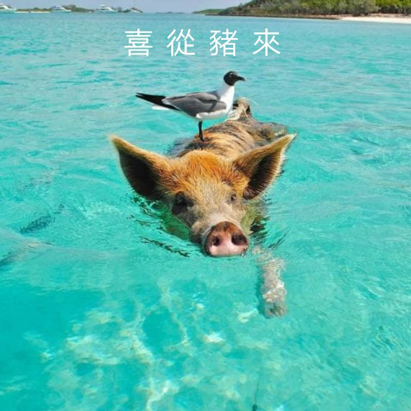

# Meow

Meow is a tool to create a kitty image with weather information.

## Quick Start

Before you start, you need to have Rust and Cargo.

```sh
curl https://sh.rustup.rs -sSf | sh
```

Then we could get the source code.

```sh
git clone https://github.com/weather-bot/meow.git
cd meow
```

You can create a demo image immediately.

```sh
make test
```

To see the full usage:

```sh
make help
```

## Demo

The original image:



The output kitty image with information:


